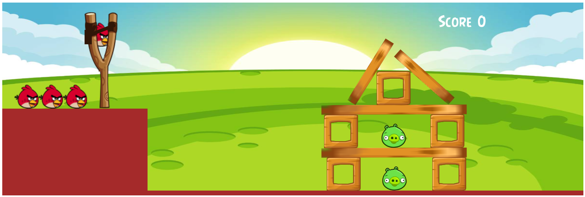

# Project: Angry Birds

This game is **The Best Game of the Early 20s.** Everyone played this fantastic game.

It is a personal project. It uses P5 Javascript Libraries. This project needs a server. It would be best if you had a local server like:

* Python Server
* 200 OK Server
* VS Code Live Server

This game is a copy of 'The Angry Birds' in Javascript.

**The controls are:**

* Mouse Drag to a location where you want to hit.
* Mouse Release after setting the location.
* Space Key for getting the new bird.
* You have 4 birds.
* After all the birds are gone, click the Reload button on the top to reload the game.

**Copyright © Pranav Bhattad, @Plbhattad7:Javascript-Games(Github)**