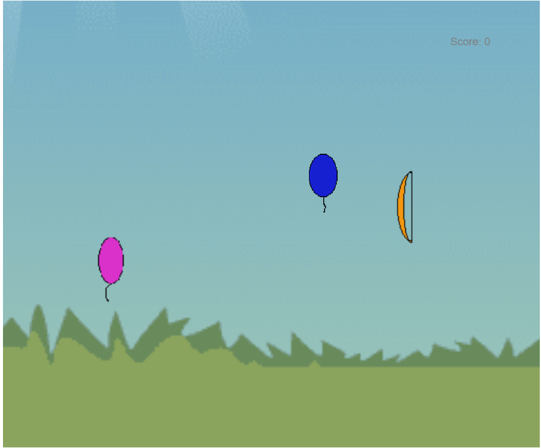

# Project: Balloon Buster

This game is **Fun Arcade Game**. If you don't know what to do in your free time, you can play it randomly

It is a personal project. It uses P5 Javascript Libraries. This project needs a server. It would be best if you had a local server like:

* Python Server
* 200 OK Server
* VS Code Live Server

**The controls are:**

* To move the bow, you should move the mouse UP and DOWN accordingly.
* `Z` Key is for Shooting the arrow.

**Copyright © Pranav Bhattad, @Plbhattad7:Javascript-Games(Github)**