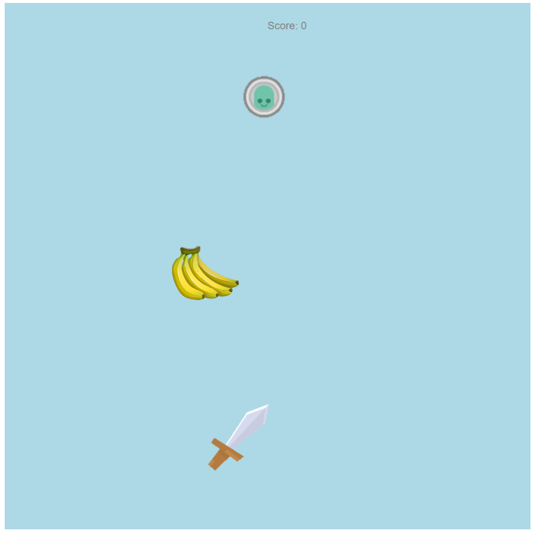

# Project: Fruit Ninja

It is another **Fun Game of the 20s** We love those games where this Arcade Gaming was booming, and this game was born. Play it and Cheers!

It is a Fruit Ninja project. It uses P5 Javascript Libraries. This project needs a server. It would be best if you had a local server like:

* Python Server
* 200 OK Server
* VS Code Live Server

**The controls are:**

* Move the mouse towards the fruit and cut it.
* Sweet little bombs are coming randomly. If you try to cut it, your game would be over!
* Chop-Chop the Fruits.

**Copyright © Pranav Bhattad, @Plbhattad7:Javascript-Games(Github)**