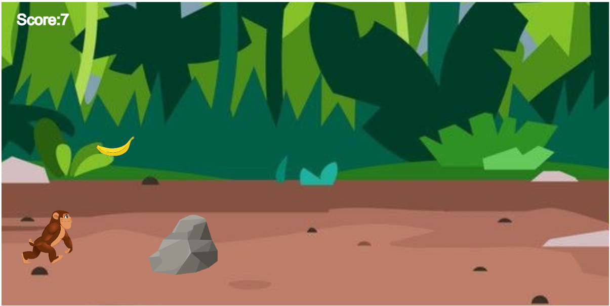

# Project: Hungry Monkey

It is a Mood Swing Game. Play it when you feel like the Ground is ripping apart.

It is a personal project. It uses P5 Javascript Libraries. This project needs a server. It would be best if you had a local server like:

* Python Server
* 200 OK Server
* VS Code Live Server

The idea of this game was from the 'Benji Bananas' in Javascript

**The controls are:**

* Jump and grab the bananas wherever you find them
* If you hit the stone in any process, then you lose score and might shrink
* It is an unlimited game, so there is no Game Over

**Copyright © Pranav Bhattad, @Plbhattad7:Javascript-Games(Github)**