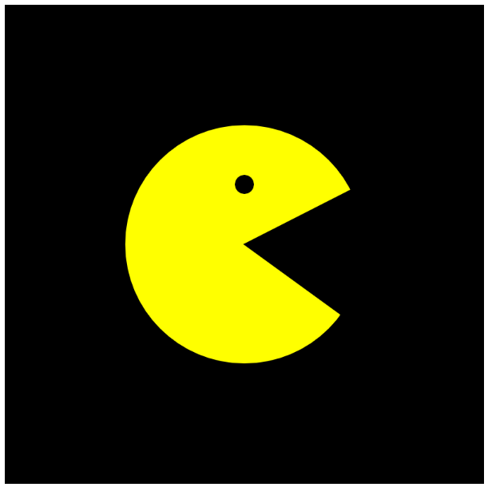

# Project: Pacman Mouth

It is just a Demo of What I was doing. I liked it so I displayed it.

It is a personal project. It uses P5 Javascript Libraries. This project needs a server. It would be best if you had a local server like:

* Python Server
* 200 OK Server
* VS Code Live Server

This game is the head of 'The Pac Man' in Javascript.

**Copyright © Pranav Bhattad, @Plbhattad7:Javascript-Games(Github)**