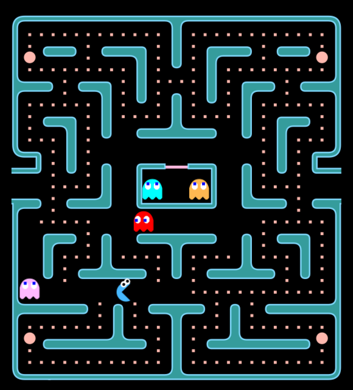

# Pac Man

A historical tribute and an accurate remake of the original Pac Man arcade game

## Play

You can play the game on all canvas-enabled browsers.  **Touch controls** are enabled for mobile browsers.  The game is **resolution-independent** and smoothly scales to
fit the size of any screen.  **Performance** may increase by shrinking the window or zooming in with your browser.

### Main Controls

- **swipe**: steer pacman on mobile browsers
- **arrows**: steer pacman
- **end**: pause the game
- **escape**: open in-game menu

Games
-----

Each of the following games is playable from the main menu.

- **Pac Man**: 1980 original arcade by Namco.
- **Ms. Pac Man**: 1981 Pac Man modification by GCC/Midway.
- **Cookie Man**: a brand new version of Ms. Pac Man with a sophisticated **procedural map generator**.

### Turbo Mode

Each game has an alternate mode called Turbo (a.k.a. speedy mode).  This feature is a popular hardware modification of the game found in many of the original arcades cabinets.  In this mode, Pac Man travels about twice as fast (same speed as the disembodied eyes of the
ghosts) and is not slowed down when eating pellets.

### High Scores

High scores for each game (normal and Turbo separately) are stored on your local machine by your browser as cookies.

## Learn Mode

Learn mode allows you to visualize the behaviours of the ghosts.  (The coloured square represents the ghost bait.)

## Practice Mode

This mode allows you to practice the game with special features.  You can go into **slow-motion** or **rewind time** with the special onscreen buttons or the hotkeys listed below. You can also turn on **invincibility** or **ghost visualizers** from the menu.
### Practice Controls

- **shift**: hold down to rewind (a la Braid)
- **1**: hold down to slow down the game to 0.5x
- **2**: hold down to slow down the game to 0.25x
- **o**: toggle Pacman turbo mode
- **p**: toggle Pacman attract mode (autoplay)
- **i**: toggle Pacman invincibility
- **n**: go to the next level
- **q,w,e,r,t**: toggle target graphic for blinky, pinky, inky, Clyde, and Pacman, respectively.
- **a,s,d,f,g**: toggle path graphic for blinky, pinky, inky, Clyde, and pacman, respectively.

**Copyright © Pranav Bhattad, @Plbhattad7:Javascript-Games(Github)**