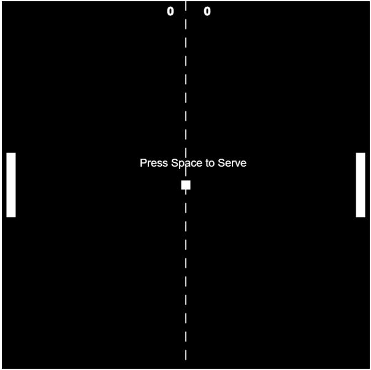

# Project: Pong Game

This game was trendy when the Arcade and Gaming Industry has just started.
It had released in **1972**. I have rebuilt it with a modern touch.

It is a personal project. It uses P5 Javascript Libraries. This project needs a server. It would be best if you had a local server like:

* Python Server
* 200 OK Server
* VS Code Live Server

This game is a copy of 'The Pong Game' in Javascript.

**The controls are:**

* The Computer would never lose.
* This game is unlimited till you get out!
* To use your paddle, move the mouse as the paddle.
* Try your best to win!
* Ping Pong!

**Copyright © Pranav Bhattad, @Plbhattad7:Javascript-Games(Github)**