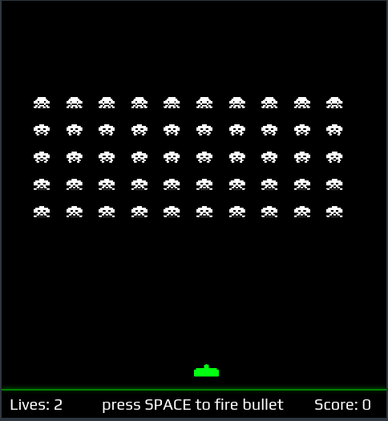

# Project: Inversion

It is another popular game of the 19s. Played by many people, you would love it.
It is one of my favourite game.

It uses Vanilla Javascript. Unlike other projects, this doesn't need a server. You can directly run the `Index.html` file.

**The Controls are:**

* Press Enter key at the start
* The game starts
* Hit space to release the bullet
* Use arrow keys to move left or right
* You have only 3 lives (You can increase your life in `script.js`. Search for `allowedLives` and change its value.)

**Copyright © Pranav Bhattad, @Plbhattad7:Javascript-Games(Github)**