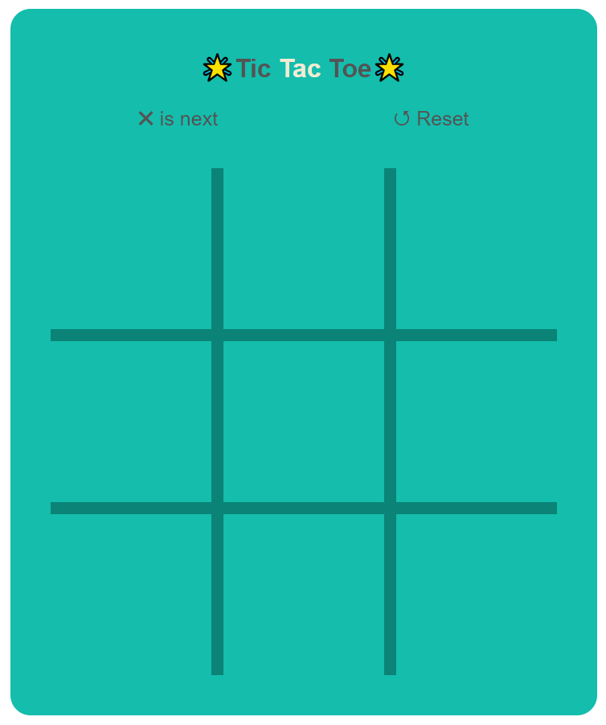

# Project: Tic Tac Toe

This game is 'The Classic Game' of all time. A little riddle with your friends to overpower each other

This game is a copy of the Tic Tac Toe game. The design is a copy of Google's Tic Tac Toe game.

The controls are:

- It is a Two-Player Game
- The First Player is 'X'
- The Second Player is
- Players take turns putting their marks in empty squares.
- The first player to get 3 of the marks in a row [Up, Down, Across or Diagonal] is the winner.
- But if all the 9 squares are filled, and no one makes a row of 3, then the game ends in a tie.

**Copyright © Pranav Bhattad, @Plbhattad7:Javascript-Games(Github)**