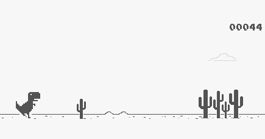

# Project: Trex Dino

This game is **Played Offline** After going offline on chrome, what do you do?
Exactly, play this game!

It is a personal project. It uses P5 Javascript Libraries. This project needs a server. It would be best if you had a local server like:

* Python Server
* 200 OK Server
* VS Code Live Server

This game is a copy of 'offline Trex Chrome' in Javascript.

**The controls are:**

* Jump and Dodge from the Cactus
* Make a great high score
* If you touch the Cactus, you are out!

**Copyright © Pranav Bhattad, @Plbhattad7:Javascript-Games(Github)**