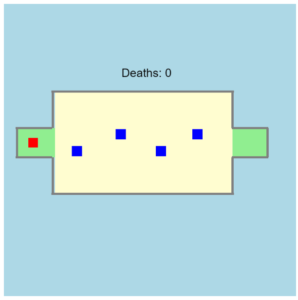

# Project: World's Hardest Game

This game is the hardest thing in the world. But remember, it is, hard not impossible.
So you can win if you give your 100%.

It uses the P5 Javascript Libraries. Unlike other projects, this doesn't need a server. You can directly run the `Index.html` file.

**The Controls are:**

* You can use the Left-Right Arrow Keys
* And also, the `WASD` Controls
* Be sure that you don't touch the obstacles (Blue Squares)
* You are the Red Square
* You have to take the Red Square to the other end to win.

**Copyright © Pranav Bhattad, @Plbhattad7:Javascript-Games(Github)**